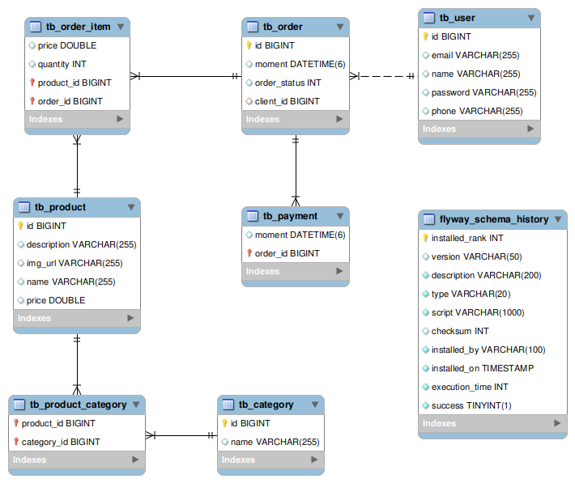
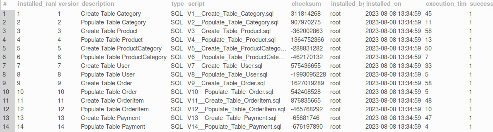

# rest-api-ordering-system

- Este projeto faz parte do exercício proposto no curso "**Java COMPLETO Programação Orientada a Objetos + Projetos**" ofertado pela Udemy.

- Diagrama de Classes implementado:

- Para implementatação foi utilizada a linguagem JAVA com mapeamento relacional usando JPA/Hibernate e banco de dados em memória H2.

# melhorias v2 (extra-curso)

- Migração do banco de dados em memória H2 para MySQL
- Suporte a Migrations com Flyway

